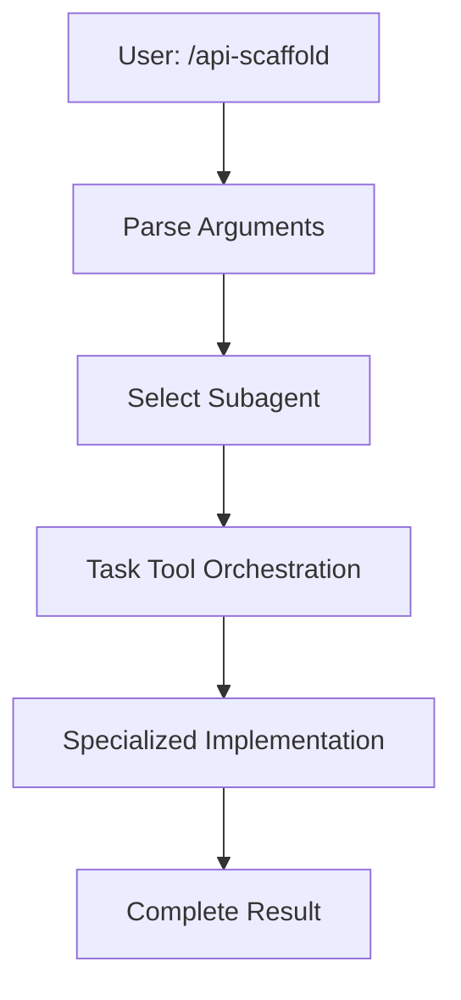
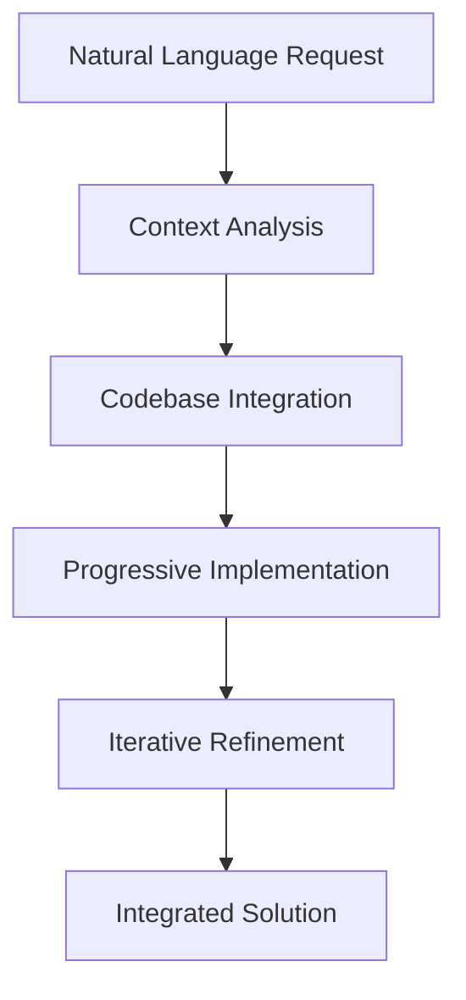
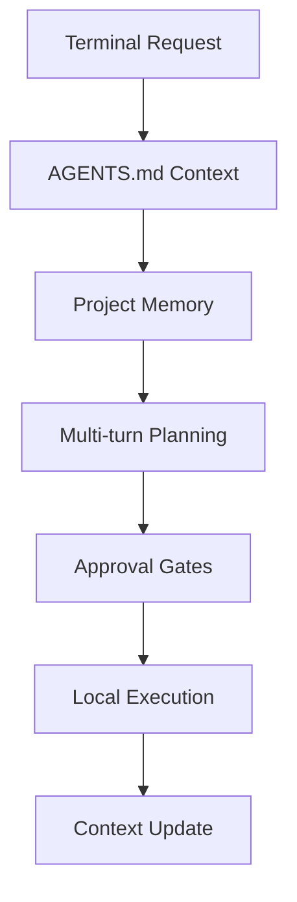

# Agentic Tooling Differentiation: OpenCode vs Claude Code vs Codex CLI

## Executive Summary

This document outlines the strategic differentiation between three major agentic development tooling approaches: **OpenCode conversational tools**, **Claude Code slash commands**, and **Codex CLI terminal agents**. Each represents a distinct paradigm for AI-assisted software development.

## Core Architectural Differences

### 1. Execution Models

#### **Claude Code (Multi-Subagent Orchestration)**
- **Pattern**: Slash command system with specialized subagents
- **Interface**: `/api-scaffold user management API`
- **Execution**: Template-based with `$ARGUMENTS` placeholders
- **Orchestration**: Multi-subagent coordination via Task tool
- **Strength**: Production-ready templates with domain experts

#### **OpenCode (Conversational Integration)**
- **Pattern**: Direct conversational interface with context awareness
- **Interface**: "Create a FastAPI user management API"
- **Execution**: Single-agent with progressive refinement
- **Orchestration**: Conversation-driven development with automatic tool selection
- **Strength**: Natural language interaction with existing codebase integration

#### **Codex CLI (Terminal-Native Agent)**
- **Pattern**: Terminal-based conversational agent with project memory
- **Interface**: `codex "Create a FastAPI API for user management"`
- **Execution**: Multi-turn conversations with AGENTS.md context
- **Orchestration**: Local filesystem integration with approval gates
- **Strength**: Terminal workflow integration with persistent project context

### 2. Command Structure Comparison

#### **Claude Code**
```markdown
# API Scaffold Generator
$ARGUMENTS

## Instructions
Use Task tool with subagent_type="backend-architect"
Create comprehensive API implementation with:
- Authentication system
- Database models
- API endpoints
- Testing framework
```

#### **OpenCode**
```markdown
# API Generator (OpenCode)
## Usage Pattern
Request through conversation: "Create a [framework] API for [description]"

## Implementation Approach
- Automatic framework detection from existing codebase
- Progressive conversation-based refinement
- Context-aware integration with existing patterns
```

#### **Codex CLI**
```markdown
# API Development Prompt (Codex CLI)
## Natural Language Pattern
"Create a [framework] API for [feature] with [requirements]"

## AGENTS.md Integration
Project context: FastAPI + SQLAlchemy + pytest
Previous implementations: user auth, product catalog
Current task: order management system
```

### 3. User Interaction Paradigms

| Aspect | Claude Code | OpenCode | Codex CLI |
|--------|-------------|----------|-----------|
| **Trigger** | `/command args` | Natural conversation | `codex "request"` |
| **Flow** | Command → Subagent → Result | Conversation → Analysis → Implementation | Terminal → Agent → Approval → Execution |
| **Context** | Template-based | Real-time codebase analysis | AGENTS.md project memory |
| **Iteration** | New command execution | Continuous conversation | Multi-turn terminal sessions |

## Detailed Platform Analysis

### 1. Claude Code: Slash Command Specialists

#### **Architecture**


#### **Strengths**
- **Domain Expertise**: Specialized subagents for different domains (backend, frontend, DevOps)
- **Production Ready**: Battle-tested templates with comprehensive implementations
- **Predictable Output**: Consistent, high-quality results
- **Multi-Domain**: Orchestrates across different technical domains

#### **Use Cases**
- Starting new projects from scratch
- Rapid prototyping with complete feature sets
- Teaching best practices through example implementations
- Cross-domain development requiring multiple specialists

#### **Example Workflow**
```bash
/api-scaffold "FastAPI user management with JWT auth"
# → backend-architect subagent
# → Complete API with models, endpoints, auth, tests
# → Docker configuration
# → Documentation
```

### 2. OpenCode: Conversational Integrator

#### **Architecture**


#### **Strengths**
- **Natural Interface**: No command syntax to learn
- **Context Awareness**: Understands existing codebase patterns
- **Progressive Development**: Builds features incrementally
- **Intelligent Integration**: Seamlessly extends existing code

#### **Use Cases**
- Extending existing applications
- Refactoring and modernizing legacy code
- Adding features to established codebases
- Learning through guided development

#### **Example Workflow**
```
User: "I need user management for my FastAPI app"
OpenCode: "I see you have FastAPI + SQLAlchemy. Should I add registration, auth, and profiles? I noticed your existing JWT setup."
User: "Yes, and add password reset"
OpenCode: "Perfect! I'll integrate with your email service. Let me start with the user model..."
```

### 3. Codex CLI: Terminal-Native Agent

#### **Architecture**


#### **Strengths**
- **Terminal Integration**: Native command-line workflow
- **Project Memory**: Persistent context across sessions
- **Local Control**: Direct filesystem modification with approval
- **Workflow Integration**: Git, testing, deployment integration

#### **Use Cases**
- Daily development workflow enhancement
- Complex multi-step feature development
- Debugging and troubleshooting assistance
- CI/CD pipeline management

#### **Example Workflow**
```bash
codex "Create user authentication for the FastAPI app"
# Agent reads AGENTS.md context
# Plans: models, endpoints, middleware, tests
# Shows plan, requests approval
# Implements step by step with progress updates
# Updates AGENTS.md with new context
```

## Strategic Differentiation Matrix

| Feature | Claude Code | OpenCode | Codex CLI |
|---------|-------------|----------|-----------|
| **Learning Curve** | Medium (slash syntax) | Low (natural language) | Low (terminal native) |
| **Integration Depth** | New projects | Existing codebases | Development workflow |
| **Output Consistency** | High (templates) | Medium (contextual) | Variable (conversational) |
| **Customization** | Limited (templates) | High (conversational) | High (iterative) |
| **Project Memory** | None | Real-time | Persistent (AGENTS.md) |
| **Multi-Domain** | Excellent | Good | Excellent |
| **Production Ready** | Immediate | Progressive | Iterative |

## Repository Organization Strategy

### **Current Structure**
```
commands/
├── opencode-tools/          # Conversational development assistants
│   ├── api-generator.md     # Natural language API development
│   ├── security-auditor.md  # Interactive security analysis
│   └── ...                  # OpenCode-specific tools
├── legacy-claude-tools/     # Original 52 slash commands
│   ├── api-scaffold.md      # Template-based API generation
│   ├── security-scan.md     # Automated security scanning
│   └── ...                  # Production-ready commands
├── codex-tools/            # Terminal-native agent patterns
│   ├── prompts/            # Natural language patterns
│   ├── agents-templates/   # AGENTS.md templates
│   └── workflows/          # Multi-turn conversations
└── workflows/              # Cross-platform orchestration
```

### **Tool Naming Conventions**

| Claude Code | OpenCode | Codex CLI |
|-------------|----------|-----------|
| `api-scaffold.md` | `api-generator.md` | `api-development.md` |
| `security-scan.md` | `security-auditor.md` | `security-analysis.md` |
| `docker-optimize.md` | `container-optimizer.md` | `container-strategies.md` |
| `test-harness.md` | `test-framework-builder.md` | `testing-strategies.md` |

## Implementation Examples

### **API Development Comparison**

#### **Claude Code Approach**
```markdown
# API Scaffold Generator
$ARGUMENTS

Create a comprehensive API implementation using backend-architect subagent:
1. Database models with relationships
2. Authentication and authorization
3. CRUD endpoints with validation
4. Testing suite with fixtures
5. Docker containerization
6. API documentation
```

#### **OpenCode Approach**
```markdown
# API Generator (OpenCode)
## Conversational Interface
"Create a [framework] API for [feature]"

## Context-Aware Implementation
- Detects existing framework (FastAPI, Express, Django)
- Integrates with current database setup
- Extends existing authentication patterns
- Maintains code style and conventions
```

#### **Codex CLI Approach**
```markdown
# API Development (Codex CLI)
## Natural Language Pattern
"Implement user management API with authentication"

## AGENTS.md Integration
```yaml
project_context:
  framework: fastapi
  database: postgresql
  auth: jwt
  testing: pytest
completed_features:
  - product_catalog
  - order_system
current_task: user_management
```

## Use Case Scenarios

### **Scenario 1: New Project Development**
- **Best Choice**: Claude Code
- **Reason**: Production-ready templates with comprehensive implementations
- **Workflow**: `/full-stack-feature "e-commerce platform"`

### **Scenario 2: Existing Codebase Enhancement**
- **Best Choice**: OpenCode
- **Reason**: Context-aware integration with existing patterns
- **Workflow**: "Add payment processing to my existing e-commerce app"

### **Scenario 3: Daily Development Workflow**
- **Best Choice**: Codex CLI
- **Reason**: Terminal integration with persistent project context
- **Workflow**: `codex "debug the authentication middleware issue"`

### **Scenario 4: Learning and Exploration**
- **Best Choice**: OpenCode
- **Reason**: Interactive conversation with explanations
- **Workflow**: "Help me understand how to implement OAuth2 in FastAPI"

### **Scenario 5: Production Deployment**
- **Best Choice**: Claude Code
- **Reason**: Battle-tested deployment configurations
- **Workflow**: `/deploy-checklist "FastAPI microservice to Kubernetes"`

## Migration Strategies

### **From Claude Code to OpenCode**
1. **Context Preparation**: Analyze existing codebase
2. **Natural Language Translation**: Convert slash commands to conversational requests
3. **Progressive Implementation**: Build features incrementally
4. **Integration Verification**: Ensure compatibility with existing code

### **From OpenCode to Codex CLI**
1. **AGENTS.md Setup**: Create project context file
2. **Terminal Integration**: Establish command-line workflow
3. **Memory Persistence**: Configure project state tracking
4. **Workflow Automation**: Connect with git, testing, deployment

### **Hybrid Approaches**
- **OpenCode + Claude Code**: Use OpenCode for exploration, Claude Code for production
- **Codex CLI + Claude Code**: Daily development with Codex, complex features with Claude Code
- **All Three**: Different tools for different development phases

## Positioning Statements

### **Claude Code Commands**
*"Production-ready slash commands with multi-subagent orchestration for rapid, comprehensive feature development"*

### **OpenCode Tools**
*"Conversational development assistants that intelligently integrate with your existing codebase through natural language interaction"*

### **Codex CLI Patterns**
*"Terminal-native agent workflows with persistent project memory for seamless daily development integration"*

## Future Convergence Opportunities

### **Unified Workflow Orchestration**
- Cross-platform command translation
- Shared project context and memory
- Hybrid execution models

### **Intelligent Routing**
- Automatic tool selection based on context
- Complexity-based agent assignment
- User preference learning

### **Ecosystem Integration**
- IDE plugin compatibility
- CI/CD pipeline integration
- Team collaboration features

This differentiation strategy ensures each agentic tooling approach provides unique value while enabling interoperability and user choice based on specific development contexts and preferences.